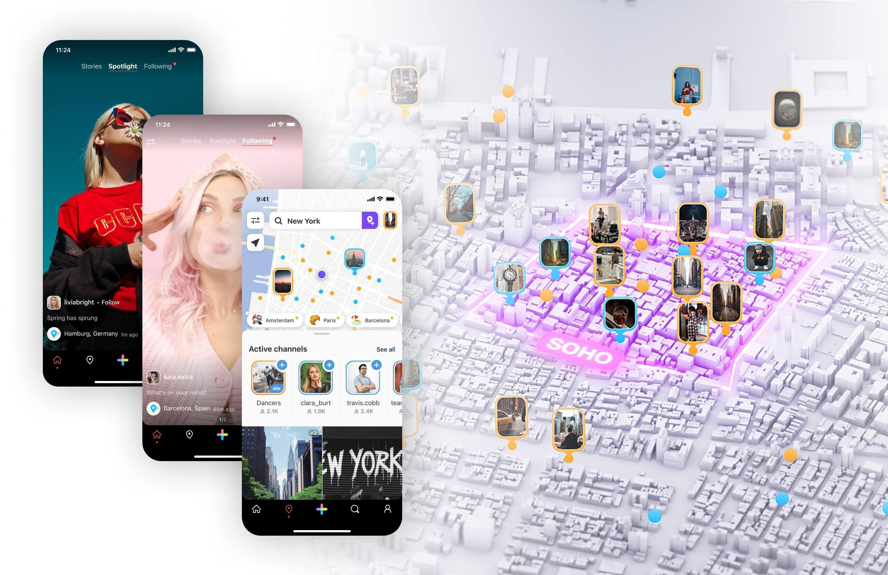

## Mylivn
#### Your Lifestyle Social Network

We are a lifestyle social network where creators have the freedom to influence their own experience. Mylivn provides a place for everyone to run their own channel in a community where being active means being seen. 

It’s like your own app within our app – a place to share your way of “livn”. 

Mylivn is always looking for new team members who are passionate about becoming a part of developing a new lifestyle social network.

## The Mylivn Approach 

Mylivn is a lifestyle social network where creators have the freedom to influence their own experience. It provides a place for everyone to run their own channel in a community where being active means being seen.

Mylivn was founded in 2015 and is based in Munich, Germany.

## Available positions 

### Product Engineering
- [Android Developer](android-developer.md)
- [Scala Backend Developer](backend-developer.md)
- [Web Developer](web-developer.md)
- [iOS Developer](ios-developer.md)
- [Quality Assurance Engineer](quality-assurance.md)

### Administration
- [Digital Markering Manager](digital-marketing-manager.md)
- [Digital Content Writer and Editor](digital-content-writer.md)
- [Paid Social Media Manager](paid-social-media-manager.md)
- [Social Media Manager](social-media-manager.md)
- [Office Management Assistant](office-management-assistant.md)
- [PR Manager](pr-manager.md)
- [Strategic Research Working Student](strategic-research-student.md)

### Design
- [Senior UI/UX Designer](ui-ux-designer.md)
- [Digital Graphic Designer](digital-graphic-designer.md)

## Benefits

- Quality equipment
- Competitive salary
- Great location and new office
- Family friendly company
- Free snacks and drinks
- New technologies